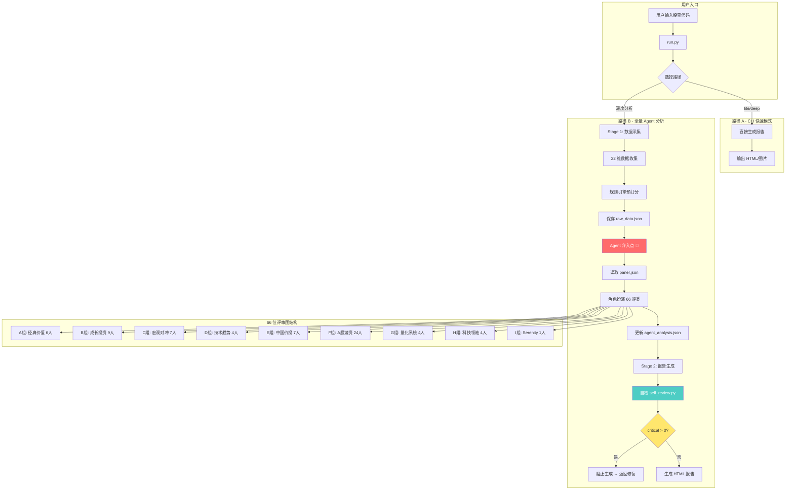
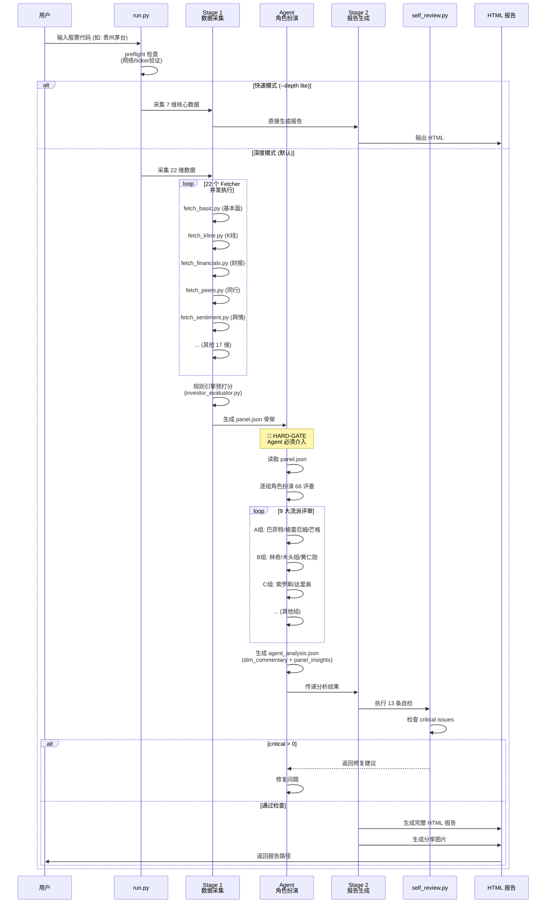
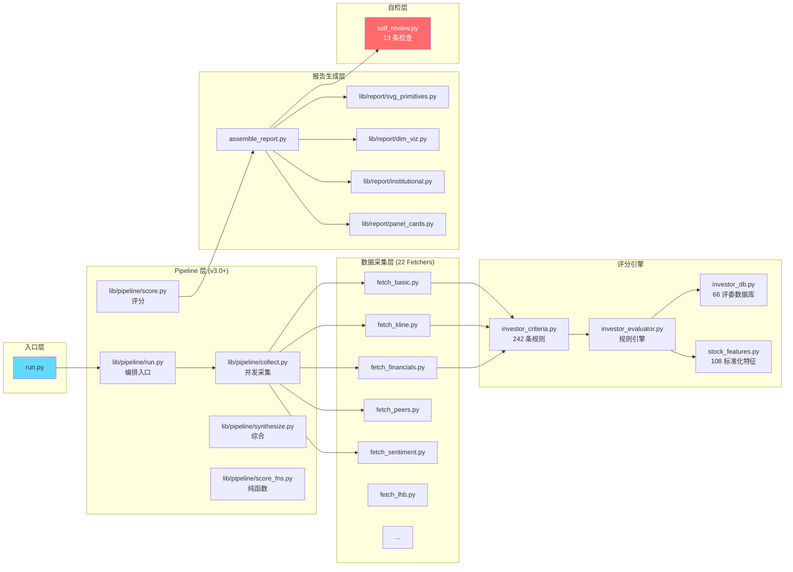
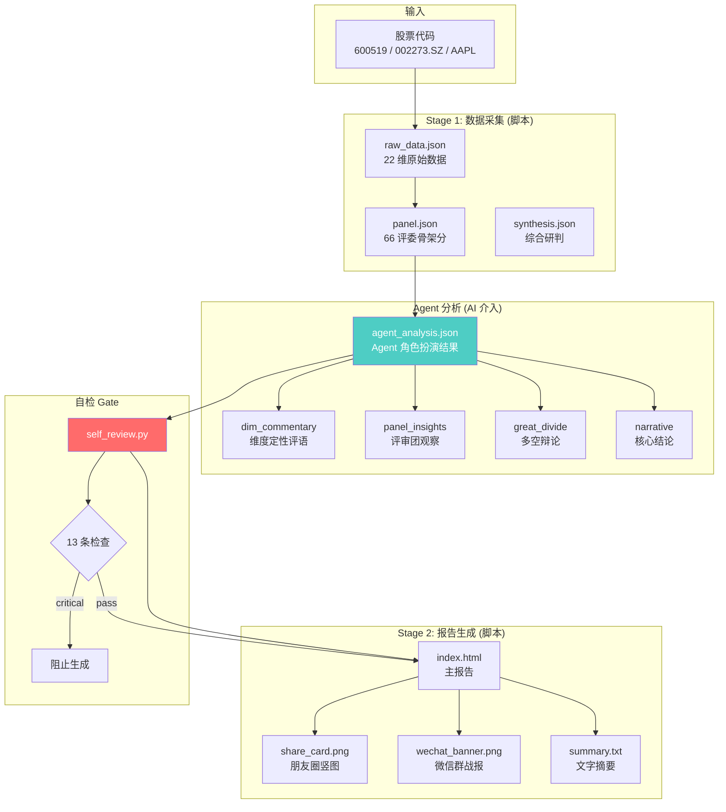
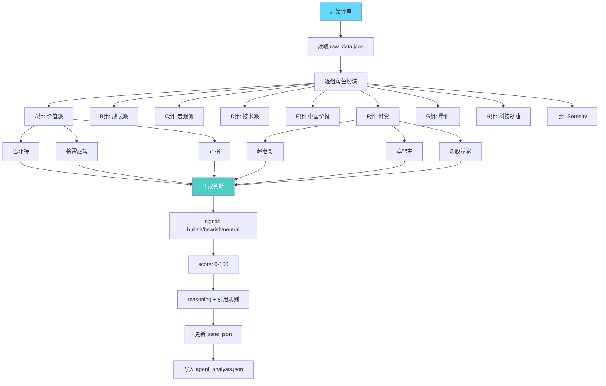

# UZI-Skill 代码流程图

## 整体架构（Mermaid）

## 详细执行流程图

## 核心模块依赖图

## 数据流图

## 66 评委评审流程

## 关键技术点

### 1. 角色扮演机制
- Agent 不是简单跑规则，而是**真正站在投资者角度思考**
- 三层评估：真实持仓 → 行业亲和度 → 量化规则
- 可以覆盖规则引擎的得分，但必须给出理由

### 2. 自检 Gate (v2.9+)
- `self_review.py` 执行 13 条自动检查
- Critical 问题 > 0 时，**物理上阻止报告生成**
- 每次新 BUG 修复后都会添加新的检查规则

### 3. 数据源 Fallback
- 40+ 数据源，3 层 Tier
- 主源失败 → 自动切换备源 → Playwright 浏览器兜底
- 确保数据可用性

### 4. 多维度分析
- 22 维数据覆盖：基本面、技术面、舆情、行业、政策等
- 17 种机构级方法：DCF、Comps、LBO、IC Memo 等
- 66 位评委 × 242 条量化规则

## 总结

**UZI-Skill 是单 Agent 系统**，核心创新在于：
1. **角色扮演代替多 Agent**：一个 Agent 模拟 66 个不同投资风格的角色
2. **两段式设计**：脚本负责数据采集/计算，Agent 负责定性分析
3. **强制自检**：通过 HARD-GATE 确保分析质量
4. **可扩展性**：易于添加新的评委和评分规则

这种设计比传统多 Agent 系统更高效，避免了 Agent 间的通信开销，同时保证了分析的一致性。
