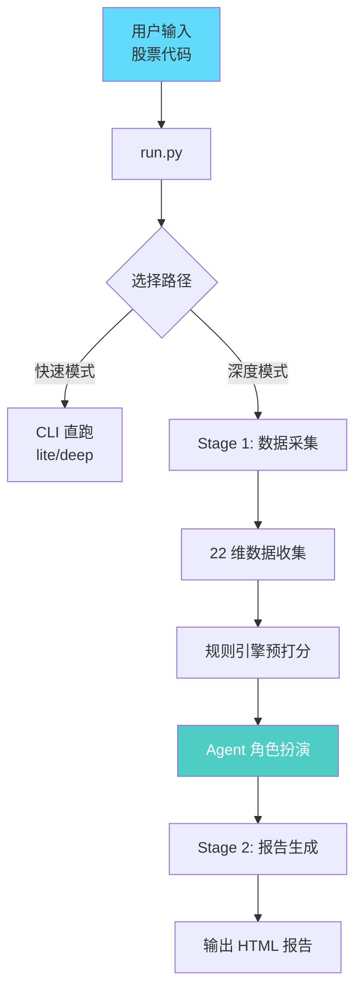
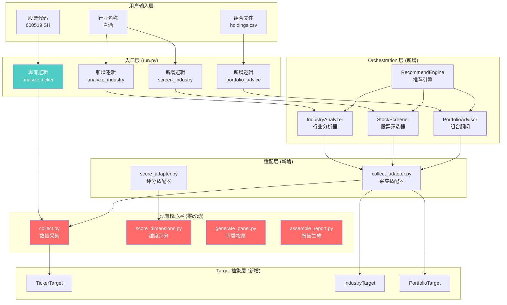
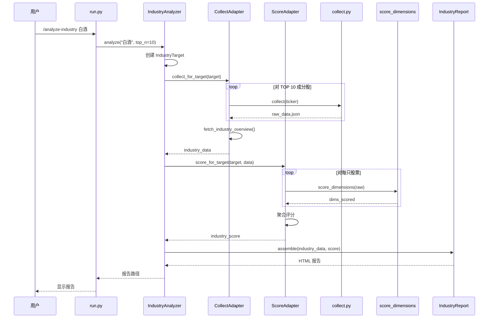
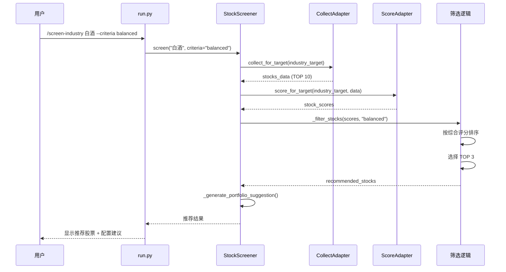
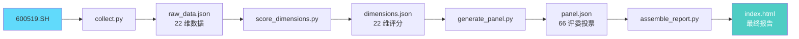
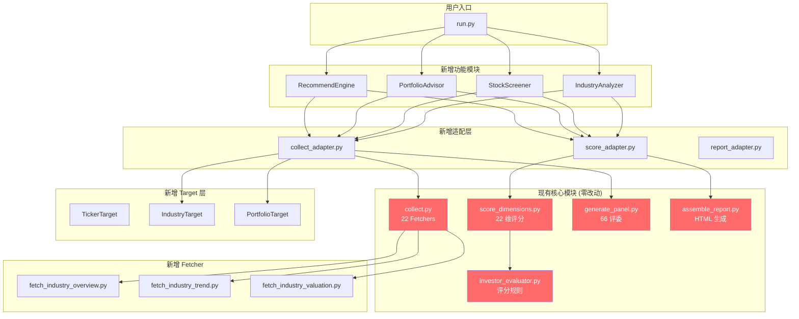
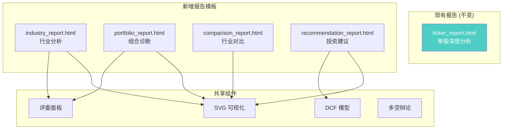

# UZI-Skill v4.0 架构流程图

## 整体架构对比

### v3.9.1 架构（现有）



---

### v4.0 架构（新增功能后）



---

## 详细执行流程图

### 功能 1：行业筛选流程



---

### 功能 2：行业选股流程



---

### 功能 3：组合诊断流程

```mermaid
sequenceDiagram
    participant User as 用户
    participant CLI as run.py
    participant PA as PortfolioAdvisor
    participant Parser as PortfolioParser
    participant CA as CollectAdapter
    participant SE as ScoreAdapter
    participant Advisor as 建议生成器
    
    User->>CLI: /portfolio-advice --file holdings.csv
    CLI->>PA: analyze(holdings)
    
    PA->>Parser: parse_csv("holdings.csv")
    Parser-->>PA: holdings_list [
        {"ticker":"600519.SH", "shares":100, "cost":1800}
    ]
    
    loop 对每只持仓股票
        PA->>CA: collect(ticker)
        CA-->>PA: raw_data
        PA->>SE: score(raw_data)
        SE-->>PA: stock_score
    end
    
    PA->>Advisor: _generate_advice(holdings, scores)
    Advisor->>Advisor: 对比当前价 vs 成本价
    Advisor->>Advisor: 对比评分 vs 持仓比例
    Advisor-->>PA: advice_list [
        {"ticker":"600519.SH", "action":"hold", "reason":"..."},
        {"ticker":"000858.SZ", "action":"buy", "reason":"..."}
    ]
    
    PA-->>CLI: 诊断结果
    CLI-->>User: 显示买入/卖出建议 + 仓位调整
```

---

### 功能串联：智能投顾流程

```mermaid
sequenceDiagram
    participant User as 用户
    participant CLI as run.py
    participant RE as RecommendEngine
    participant IA as IndustryAnalyzer
    participant SS as StockScreener
    participant PA as PortfolioAdvisor
    
    User->>CLI: /recommend-portfolio 白酒,新能源,医药 --budget 10万
    CLI->>RE: recommend(industry_list, budget, risk)
    
    Note over RE: 步骤 1：行业筛选
    RE->>IA: compare(["白酒","新能源","医药"])
    IA->>IA: 分析每个行业
    IA-->>RE: industry_ranking [
        {"industry":"白酒", "score":80},
        {"industry":"新能源", "score":65}
    ]
    RE->>RE: selected_industry = "白酒"
    
    Note over RE: 步骤 2：个股筛选
    RE->>SS: screen("白酒", criteria="balanced")
    SS-->>RE: recommended_stocks [
        {"ticker":"600519.SH", "score":85},
        {"ticker":"000858.SZ", "score":78}
    ]
    
    Note over RE: 步骤 3：生成组合配置
    RE->>PA: allocate_budget(stocks, budget, risk)
    PA->>PA: 根据评分分配资金
    PA->>PA: 计算现金储备
    PA-->>RE: portfolio {
        "positions": [...],
        "cash_reserve": 20000
    }
    
    RE->>RE: _generate_report()
    RE-->>CLI: 完整投资建议报告
    CLI-->>User: 显示行业选择 + 推荐股票 + 资金配置
```

---

## 数据流图

### 现有功能数据流（不变）



---

### 新功能：行业分析数据流

```mermaid
graph LR
    A[白酒] --> B[IndustryAnalyzer]
    B --> C[collect_adapter.py]
    
    C --> D1[collect(600519.SH)<br/>现有函数]
    C --> D2[collect(000858.SZ)<br/>现有函数]
    C --> D3[collect(...)<br/>TOP 10 成分股]
    C --> D4[fetch_industry_overview()<br/>新增 Fetcher]
    
    D1 --> E1[raw_data_1.json]
    D2 --> E2[raw_data_2.json]
    D3 --> E3[...]
    D4 --> E4[industry_overview.json]
    
    E1 --> F[score_adapter.py]
    E2 --> F
    E3 --> F
    
    F --> G1[score_dimensions(1)<br/>现有函数]
    F --> G2[score_dimensions(2)<br/>现有函数]
    F --> G3[...]
    
    G1 --> H[聚合评分]
    G2 --> H
    G3 --> H
    
    H --> I[industry_report.py]
    E4 --> I
    I --> J[industry_report.html<br/>行业报告]
    
    style A fill:#61dafb
    style J fill:#4ecdc4,color:#fff
```

---

### 新功能：组合诊断数据流

```mermaid
graph LR
    A[holdings.csv] --> B[PortfolioParser]
    B --> C[holdings_list]
    
    C --> D1[collect(600519.SH)<br/>现有函数]
    C --> D2[collect(000858.SZ)<br/>现有函数]
    C --> D3[...]
    
    D1 --> E1[raw_data_1.json]
    D2 --> E2[raw_data_2.json]
    D3 --> E3[...]
    
    E1 --> F[score_adapter.py]
    E2 --> F
    
    F --> G[stock_scores]
    C --> G
    
    G --> H[建议生成器]
    H --> I{买入/卖出/持有?}
    I --> J1[buy: 估值低估]
    I --> J2[sell: 评分过低]
    I --> J3[hold: 估值合理]
    
    J1 --> K[portfolio_report.py]
    J2 --> K
    J3 --> K
    
    K --> L[portfolio_advice.html<br/>组合诊断报告]
    
    style A fill:#61dafb
    style L fill:#4ecdc4,color:#fff
```

---

## 模块依赖图



---

## 缓存结构对比

### v3.9.1 缓存结构（不变）

```
.cache/
├── 600519.SH/
│   ├── raw_data.json
│   ├── dimensions.json
│   ├── panel.json
│   └── synthesis.json
├── 000858.SZ/
│   └── ...
└── _global/
    └── network_profile.json
```

---

### v4.0 缓存结构（扩展，兼容）

```
.cache/
├── 600519.SH/              # ✅ 现有结构不变
│   └── ...
├── industry/               # 🆕 新增：行业缓存
│   ├── 白酒/
│   │   ├── industry_overview.json
│   │   ├── industry_score.json
│   │   ├── 600519.SH/
│   │   │   ├── dimensions.json
│   │   │   └── panel.json
│   │   └── 000858.SZ/
│   │       └── ...
│   └── 新能源/
│       └── ...
├── portfolio/              # 🆕 新增：组合缓存
│   └── {timestamp}/
│       ├── holdings.json
│       ├── advice.json
│       └── report.html
└── _global/               # ✅ 现有结构不变
    └── ...
```

---

## 报告模板结构



---

## 关键设计模式

### 1. 适配器模式（Adapter Pattern）

```python
# 新代码通过适配器调用老代码
class CollectAdapter:
    def collect_for_target(self, target: AnalysisTarget):
        if target.target_type == "ticker":
            # 调用现有函数
            return collect(target.name)  # 现有 API
        elif target.target_type == "industry":
            # 批量调用现有函数
            return self._collect_industry(target)
```

**优势**：现有代码零改动，新代码灵活调用

---

### 2. 策略模式（Strategy Pattern）

```python
# 筛选标准可扩展
class StockScreener:
    def screen(self, industry: str, criteria: str):
        strategy = self._get_strategy(criteria)
        return strategy.filter(stocks)
    
    def _get_strategy(self, criteria: str):
        strategies = {
            "value": ValueStrategy(),
            "growth": GrowthStrategy(),
            "balanced": BalancedStrategy(),
            "aggressive": AggressiveStrategy()
        }
        return strategies[criteria]
```

**优势**：新增筛选标准只需添加策略类，不需修改主逻辑

---

### 3. 模板方法模式（Template Method Pattern）

```python
# 报告生成统一流程
class BaseReportGenerator(ABC):
    def assemble(self, data: Dict) -> str:
        """模板方法"""
        self._generate_header(data)
        self._generate_body(data)  # 抽象方法
        self._generate_footer(data)
        return self._render_html()
    
    @abstractmethod
    def _generate_body(self, data: Dict):
        pass

class IndustryReportGenerator(BaseReportGenerator):
    def _generate_body(self, data: Dict):
        # 行业报告特有逻辑
        pass
```

**优势**：报告结构统一，内容灵活

---

## 性能优化策略

### 1. 并发采集（复用现有逻辑）

```python
# collect_adapter.py
def collect_industry(target: IndustryTarget) -> Dict:
    stocks = target.get_components()  # TOP N 成分股
    
    # 复用现有并发逻辑（max_workers=6）
    with ThreadPoolExecutor(max_workers=6) as executor:
        futures = {
            executor.submit(collect, ticker): ticker
            for ticker in stocks
        }
        # ...
```

---

### 2. 缓存复用（兼容现有机制）

```python
# 行业分析时，如果成分股已缓存，直接读取
def collect_for_target(target: IndustryTarget) -> Dict:
    stocks_data = {}
    for ticker in target.get_components():
        cache_path = Path(f".cache/{ticker}/raw_data.json")
        if cache_path.exists():
            # 复用现有缓存
            stocks_data[ticker] = json.loads(cache_path.read_text())
        else:
            stocks_data[ticker] = collect(ticker)
    return stocks_data
```

---

### 3. 增量分析

```python
# 组合诊断时，只重新分析变化的持仓
def analyze_portfolio(holdings: List[Dict], resume: bool = True):
    for holding in holdings:
        ticker = holding["ticker"]
        if resume and is_cache_valid(ticker):
            # 复用现有分析结果
            continue
        else:
            # 重新分析
            analyze_ticker(ticker)
```

---

## 总结

### 设计优势

1. **100% 向后兼容**：现有功能完全不变
2. **最大化复用**：新功能复用现有 22 个 Fetcher 和评分引擎
3. **模块化**：每个功能独立，易于测试和维护
4. **可扩展**：未来可轻松添加板块分析、跨境对比等

### 关键文件清单

| 文件 | 操作 | 说明 |
|------|------|------|
| `run.py` | 修改 | 添加新参数（不修改现有流程） |
| `lib/target/*.py` | 新增 | 目标抽象层 |
| `lib/pipeline/collect_adapter.py` | 新增 | 采集适配器 |
| `lib/pipeline/score_adapter.py` | 新增 | 评分适配器 |
| `lib/analysis/*.py` | 新增 | 4 个分析器 |
| `lib/report/*.py` | 新增 | 3 个报告模板 |
| `skills/deep-analysis/scripts/fetch_industry*.py` | 新增 | 3 个行业 Fetcher |
| `commands/*.md` | 新增 | 4 个 Slash Commands |
| `SKILL.md` | 修改 | 添加新功能文档 |

### 开发优先级

1. **P0**：Target 抽象层 + 采集适配器 + 评分适配器（基础架构）
2. **P1**：功能 1（行业筛选）+ 功能 2（行业选股）
3. **P2**：功能 3（组合诊断）
4. **P3**：功能串联（智能投顾）

---

**下一步**：开始代码实现 🚀
